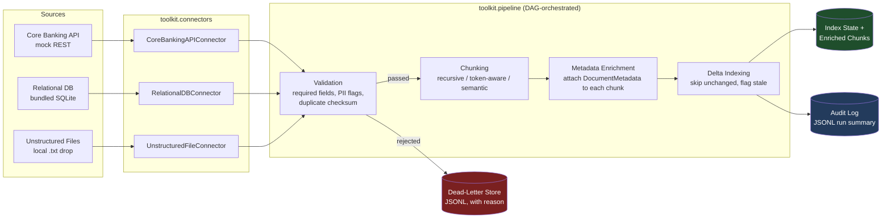

# Enterprise Document Pipeline Toolkit: LangChain-Powered Ingestion, Chunking & Semantic Indexing for Financial Data Sources

> **Fictional bank disclosure**: this repository uses "**Northbridge Financial
> Group**" as example data throughout -- a wholly invented bank created
> solely for this demo. No real employer, institution, customer, or
> employee data appears anywhere in this repository. All documents, SSNs,
> account numbers, and case notes are synthetic test fixtures.

## Why this exists

Retrieval-augmented generation (RAG) and agentic AI systems live or die by
the quality of the data pipeline feeding them -- a fact that shows up
explicitly in senior AI engineering job requirements as "data pipelines
optimized for LLM workloads." Most public RAG demos skip straight to
"load a PDF, embed it, done" and never touch the parts that make a pipeline
*production-grade at a regulated financial institution*: mandatory
governance metadata, PII surfacing instead of silent dropping, dead-letter
routing, delta/incremental indexing so you're not re-embedding the world
every night, and an audit trail of what happened to every document.

This repository is an **installable Python toolkit + CLI** (`pip install
-e .` then `toolkit ...`) that other teams could import and build on --
not a one-off demo app. It runs **fully offline** by default: every
connector is mocked, SQLite-backed, or reads local synthetic files, so a
reviewer can clone this repo and run the whole thing with zero API keys and
zero network calls.

## Architecture



Every stage above is a separate, independently unit-tested Python package
under `toolkit/`:

| Layer | Module | Responsibility |
|---|---|---|
| Connectors | `toolkit/connectors/` | Pull raw documents from a source system into a uniform `RawDocument` |
| Validation | `toolkit/validation.py` | Required-field checks, PII pattern flags, duplicate detection, dead-letter routing |
| Chunking | `toolkit/chunking/` | Split validated document text into retrieval-sized chunks (3 interchangeable strategies) |
| Metadata | `toolkit/metadata.py` | The canonical `DocumentMetadata` schema every chunk carries downstream |
| Indexing | `toolkit/indexing.py` | Delta/incremental indexing: skip unchanged docs, flag stale ones |
| Orchestration | `toolkit/dag.py`, `toolkit/pipeline.py` | Tiny hand-rolled DAG runner wiring the stages together, with tracing spans + an audit log |
| CLI | `toolkit/cli.py` | Typer entrypoint (`toolkit ingest / reindex / validate / dead-letter / health-check`) |

## Key Design Decisions

**1. Three chunking strategies behind one interface, not one "best" chunker.**
Different content types and latency budgets call for different tradeoffs;
this toolkit ships all three behind `toolkit.chunking.base.Chunker` so the
choice is a `--strategy` flag, not a rewrite.

| Strategy | How it decides boundaries | Latency | Coherence | Notes / cost |
|---|---|---|---|---|
| `recursive` | LangChain `RecursiveCharacterTextSplitter`; tries paragraph → line → sentence → word separators | Lowest (pure string ops) | Medium -- respects natural text boundaries but ignores meaning | No extra dependency beyond `langchain-text-splitters`; good default |
| `token-aware` | Approximate token budget (whitespace "words" as an offline proxy for tokens) | Low | Medium -- same idea as recursive but sized to a model's context budget | Avoids a real tokenizer (e.g. `tiktoken`) on purpose -- most tokenizer libs fetch vocab files over the network on first use, which would break this repo's offline-by-default requirement. Swap in a real tokenizer here for production. |
| `semantic` | Groups sentences while a running cosine-similarity centroid stays above a threshold | Highest of the three (still offline/instant here, but this is where a *real* implementation pays an embedding-API-call-per-sentence cost) | Highest -- chunks tend to be topically coherent | Uses a deterministic, hash-based `MockEmbedder` (`toolkit/chunking/semantic.py`) instead of a real embeddings API, so the demo stays offline and reproducible. The `EmbeddingProvider` interface is the seam where a real embeddings client would plug in. |

**2. `RawDocument` vs. `DocumentMetadata` -- validation is a single choke point, not scattered checks.**
Connectors return a loosely-typed `RawDocument` (raw, possibly-incomplete
metadata as read from the source) rather than the strict
`DocumentMetadata` model directly. `toolkit.validation.DataQualityValidator`
is the *only* place that decides whether a document's metadata is complete
enough to become a trusted `DocumentRecord`. This keeps connectors simple
(no duplicated validation logic per source) and gives governance a single
audit point instead of three.

**3. Delta indexing is content-hash-based, not timestamp-based.**
`toolkit.indexing.DeltaIndex` compares a SHA-256 checksum of document
content, not a "last modified" timestamp from the source -- source systems
often don't expose a reliable modified-at signal, but content never lies.
Trade-off: switching chunking *strategy* alone does not force a document to
be re-chunked, since the strategy isn't part of the content hash (see
Roadmap).

**4. A ~100-line hand-rolled DAG runner instead of Airflow/Prefect/Dagster.**
`toolkit/dag.py` does exactly three things: register named stages with
dependencies, topologically sort them, and support partial re-run
(`only=["chunk"]` pulls in "chunk"'s transitive dependencies so it re-runs
with valid inputs). At this toolkit's scale (5 in-process stages, single
CLI invocation) a full orchestration framework would be dependency weight
without benefit -- see Roadmap for when you'd graduate off this.

**5. PII is flagged, never silently redacted or silently indexed.**
`toolkit.validation` scans content for SSN-/account-number-shaped patterns
and attaches the flag to the validation outcome and the audit log --
deciding what happens next (manual review queue, masking, etc.) is left to
the calling application. Silently stripping the data would hide a
data-handling problem from the people who need to see it.

## Governance & Guardrails

See **[GOVERNANCE.md](GOVERNANCE.md)** for the full writeup. Summary:

- **Mandatory data classification** (`public|internal|confidential|restricted`)
  on every ingested document -- there is no default value; a document
  without one cannot pass validation.
- **Audit log** of every pipeline run (`data/state/audit_log.jsonl`):
  documents seen / indexed / reindexed / skipped / failed, per run.
- **PII pattern flags surfaced**, not silently dropped (see Key Design
  Decision #5).
- **Dead-letter store** (`data/state/dead_letter.jsonl`) with a
  human-readable reason for every document that fails validation --
  inspect via `toolkit dead-letter list`.
- **Retention tagging** on every document, carried through to every chunk.
- **Staleness detection** against a configurable freshness SLA.

## Getting Started

Requires Python 3.11+. No API keys, no external services.

```bash
git clone <this-repo-url>
cd langchain-document-pipeline-toolkit

python -m venv .venv
source .venv/bin/activate        # .venv\Scripts\activate on Windows

pip install -e ".[dev]"          # or: make install
```

### Run the demo pipeline

```bash
# Ingest each bundled sample source (mock core-banking API, SQLite sample
# DB auto-created on first run, and a folder of synthetic .txt files):
toolkit ingest --source core-banking
toolkit ingest --source relational-db
toolkit ingest --source unstructured-files

# Try a different chunking strategy:
toolkit ingest --source unstructured-files --strategy semantic

# Run again -- delta indexing skips unchanged documents:
toolkit ingest --source core-banking          # docs_skipped_unchanged: 3

# Validate only (no indexing side effects):
toolkit validate --source unstructured-files

# Reindex documents effective on/after a given date:
toolkit reindex --since 2026-02-01

# Inspect documents that failed validation:
toolkit dead-letter list

# Offline health/readiness check (verifies every connector is reachable):
toolkit health-check
```

Sample output from `toolkit ingest --source unstructured-files` (one of the
five bundled sample files, `northbridge_incomplete_upload.txt`, is
*intentionally* missing its governance metadata to demonstrate dead-letter
routing; another, `northbridge_kyc_procedure.txt`, contains synthetic
SSN-/account-number-shaped strings to demonstrate PII flagging):

```
   Pipeline run 4b681c7114f6
(unstructured-files / semantic)
+-----------------------------+
| Metric              | Count |
|---------------------+-------|
| Documents seen      |     5 |
| Newly indexed       |     4 |
| Reindexed (changed) |     0 |
| Skipped (unchanged) |     0 |
| Failed validation   |     1 |
| PII-flagged         |     1 |
| Stale documents     |     0 |
+-----------------------------+
PII pattern flags surfaced on: northbridge_kyc_procedure
```

### Run the tests

```bash
make test        # pytest -v --cov=toolkit --cov-report=term-missing
make lint         # ruff check .
make typecheck     # mypy toolkit
```

54 unit + integration tests cover every connector, all three chunking
strategies, metadata validation, delta-indexing skip/reprocess logic, and
dead-letter routing (missing metadata, invalid values, duplicate checksums,
PII flags-without-rejection).

## Production Deployment

**Docker** (multi-stage build, pinned base image, non-root user):

```bash
docker build -t langchain-document-pipeline-toolkit:local .
docker run --rm langchain-document-pipeline-toolkit:local health-check

# Or via docker-compose, with sample data + pipeline state mounted from the host:
docker compose run --rm toolkit ingest --source unstructured-files
```

**Kubernetes** (`deploy/k8s/`): the toolkit runs as a batch workload, not a
long-lived service, so it's deployed as a `CronJob` (incremental reindex on
a schedule) plus a one-off `Job` for the initial full ingest -- both backed
by a `PersistentVolumeClaim` so delta-index state survives across runs. An
`initContainer` running `toolkit health-check` acts as the readiness gate
before the main container starts (see Observability below for how this
maps onto `/healthz`/`/readyz` if the toolkit ever grows an HTTP layer).
See **[deploy/OPENSHIFT.md](deploy/OPENSHIFT.md)** for the SCC adjustments
needed to run the same manifests on OpenShift.

**CI** (`.github/workflows/ci.yml`): lint (ruff) → type-check (mypy) → unit
tests on Python 3.11 and 3.12 → package build check (`python -m build` +
install the wheel + run `toolkit --help`) → Docker build + smoke test, all
on every push/PR to `main`.

## Observability

This toolkit doesn't ship a Prometheus exporter (out of scope for a
CLI-first tool), but it's built with the seams a real deployment would wire
up:

- **Tracing spans per stage** (`toolkit.pipeline._span`): every DAG stage
  logs a start/complete event with duration -- the same shape as an
  OpenTelemetry span (`tracer.start_as_current_span`); swapping this
  context manager for a real OTel span is a contained change.
- **Structured JSON logs** (`toolkit/logging_utils.py`) with a per-run
  correlation ID (`run_id`) on every line -- ship these to any log
  aggregator and filter/join by `run_id` to reconstruct one pipeline run.
- **Metrics you'd emit in production**, derived directly from
  `PipelineSummary` (`toolkit/pipeline.py`) and already computed by every
  run:
  - `docs_per_second` -- `docs_seen / (finished_at - started_at)`, per source/strategy
  - `failure_rate` -- `docs_failed_validation / docs_seen`
  - `staleness_count` -- `len(stale_doc_ids)`, alert when > 0
  - `pii_flag_rate` -- `len(pii_flagged_doc_ids) / docs_seen`
  - `chunk_count` per document, from `DeltaIndex.IndexEntry.chunk_count`

  Emitting these as Prometheus counters/gauges from `AuditLog.record()`
  (one `push_to_gateway` call per run, since this is a batch job rather
  than a scrape target) and building a Grafana dashboard on top is the
  natural next step -- see Roadmap.

## Tech Stack

| Concern | Choice | Why |
|---|---|---|
| Language | Python 3.11+ | Ecosystem fit for LangChain / RAG tooling |
| Chunking | `langchain-text-splitters` | Industry-standard recursive splitter; same interface most RAG stacks already use |
| Config | `pydantic-settings` | Typed, env-var-driven config; no hardcoded secrets |
| Validation / schemas | `pydantic` v2 | Fast, strict schema enforcement everywhere (`DocumentMetadata`, `RawDocument`, chunk models) |
| CLI | `typer` (+ `rich` for tables) | Type-hint-driven CLI with minimal boilerplate |
| Resilience | `tenacity` | Exponential backoff + jitter on connector I/O |
| Storage (demo) | SQLite (bundled/auto-seeded), JSONL (dead-letter, audit log), JSON (delta-index state) | Zero external services required to run the demo |
| Orchestration | Hand-rolled `toolkit/dag.py` | Right-sized for 5 in-process stages; see Key Design Decision #4 |
| Testing | `pytest`, `pytest-cov` | Standard, fast |
| Lint / types | `ruff`, `mypy` | Fast lint + static typing gate in CI |
| Packaging | `setuptools`, `pyproject.toml` | Standard installable package + `toolkit` console script |
| Containers | Docker (multi-stage, non-root), `docker-compose` | Local dev + CI build check |
| Deployment | Kubernetes `CronJob`/`Job` manifests, OpenShift notes | Batch-workload-appropriate scheduling |

## Repository Structure

```
langchain-document-pipeline-toolkit/
├── toolkit/                        # the installable package
│   ├── __init__.py
│   ├── config.py                   # pydantic-settings Settings (env-driven)
│   ├── logging_utils.py            # structured JSON logging + run-id correlation
│   ├── metadata.py                 # DocumentMetadata / DocumentRecord schemas
│   ├── dag.py                      # tiny dependency-ordered pipeline runner
│   ├── pipeline.py                 # wires connectors→validation→chunking→index
│   ├── validation.py               # data-quality gate + dead-letter store
│   ├── indexing.py                 # delta indexing + staleness detection
│   ├── cli.py                      # Typer entrypoint (`toolkit` command)
│   ├── connectors/
│   │   ├── base.py                 # SourceConnector ABC, RawDocument
│   │   ├── core_banking.py         # mock REST connector (in-memory)
│   │   ├── relational_db.py        # SQLite-backed connector (auto-seeded)
│   │   └── unstructured_files.py   # local .txt directory connector
│   └── chunking/
│       ├── base.py                 # Chunker ABC, Chunk model
│       ├── recursive.py            # RecursiveCharacterTextSplitter adapter
│       ├── token_aware.py          # approximate token-budget chunker
│       └── semantic.py             # mock-embedding similarity chunker
├── data/
│   └── sample_unstructured/        # synthetic Northbridge Financial Group .txt files
├── tests/                          # pytest suite (connectors, chunking, validation, indexing, dag, pipeline)
├── deploy/
│   ├── k8s/                        # Namespace, ConfigMap, PVC, CronJob, Job
│   └── OPENSHIFT.md
├── .github/workflows/ci.yml        # lint, typecheck, test, build, docker
├── Dockerfile                      # multi-stage, non-root, pinned base image
├── docker-compose.yml              # local dev, mounted sample-data volume
├── pyproject.toml                  # package metadata, pinned dependencies
├── Makefile                        # install / test / lint / run targets
├── .env.example
├── GOVERNANCE.md
├── SECURITY.md
├── CONTRIBUTING.md
└── LICENSE
```

## Roadmap / What I'd Build Next

- **Real vector store integration**: swap `EnrichedChunk` output for writes
  into an actual vector DB (pgvector / OpenSearch / a managed service),
  behind a small `IndexWriter` interface so the demo can stay offline
  while production wires in the real thing.
- **Real embeddings for the semantic chunker**: implement a second
  `EmbeddingProvider` calling an internal model-serving endpoint, selected
  via config, with `MockEmbedder` remaining the offline/test default and a
  real tokenizer (`tiktoken` or the target model's tokenizer) swapped into
  the `token-aware` strategy the same way. A natural companion project:
  wiring a LangGraph/MCP agentic retrieval layer on top of this index.
- **Strategy-aware delta indexing**: include the chunking strategy in the
  cache key so switching `--strategy` forces reprocessing (documented
  current limitation, Key Design Decision #3). Also migrate
  `DeadLetterStore`/`AuditLog` off JSONL to a real relational or object
  store once dead-letter volume outgrows a flat file.
- **Prometheus/Grafana wiring**: emit the metrics listed under
  Observability as real Prometheus counters/gauges (`docs_per_second`,
  `failure_rate`, `staleness_count`, `pii_flag_rate`) via a `pushgateway`
  call at the end of each run, plus a starter Grafana dashboard JSON.
- **pip-audit / Dependabot in CI**: automated dependency vulnerability
  scanning on top of the version pins in `pyproject.toml`.
- **HTTP trigger layer**: an optional thin FastAPI wrapper exposing
  `/healthz`, `/readyz`, and a `POST /pipelines/{source}/run` endpoint for
  teams that want to trigger ingestion from an external scheduler instead
  of `kubectl`/cron -- CLI would remain the primary interface.
